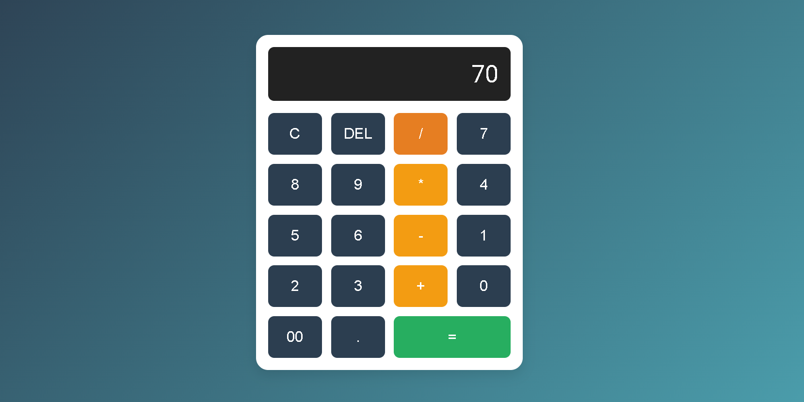

# Basic Calculator Application

This is a simple Calculator application that allows users to perform basic arithmetic operations. It's a beginner-friendly project made using HTML, CSS, and JavaScript.

## Features

- Addition, subtraction, multiplication, and division
- Clear input
- User-friendly and responsive interface
- Real-time calculation updates

## Demo

You can try the live demo [here](https://sarbajitacharjee.github.io/InternPe/).

## Screenshots



## Getting Started

Follow the instructions below to get a copy of the project up and running on your local machine for development and testing purposes.

### Prerequisites

You need a modern web browser (Chrome, Firefox, Safari, etc.) to run this project.

### Installation

1. **Clone the repository:**

```bash
git clone https://github.com/sarbajitacharjee/Calculator_App.git
```

Navigate to the project directory:
```
cd calculator-app
```
Open index.html in your browser:
You can simply open the index.html file with your browser to view the app.

## Usage
Perform calculations: Use the buttons to perform basic arithmetic operations.
Clear input: Use the "C" or "Clear" button to reset the calculator.
Responsive design: The calculator works well on both desktop and mobile devices.